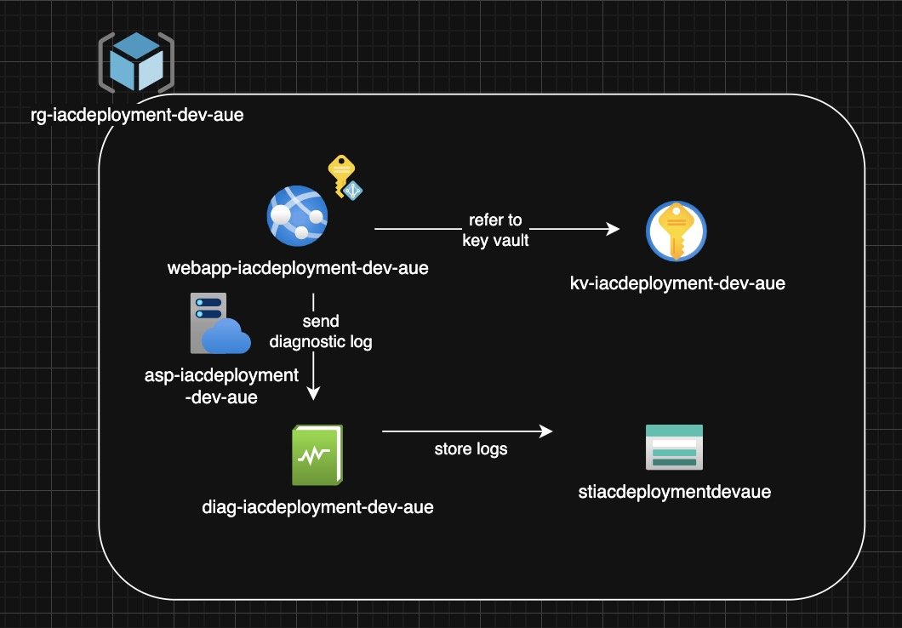

# Azure App Service Deployment with Terraform

Infrastructure as code project that deploys Azure App Service with Terraform. Shows security best practices with managed identities, RBAC, and diagnostic logging.

## What This Project Does

Deploys Azure Web App with:
- Linux App Service with Node.js runtime
- Key Vault for secrets (using managed identity + RBAC)
- Diagnostic logs going to Storage Account
- TLS 1.2 minimum and HTTPS only
- Modular Terraform code in a separate [modules repo](https://github.com/koala1707/terraform_modules)

## Architecture

**How it works:**
- Web App uses managed identity to access Key Vault (no credentials needed)
- Logs stored in Storage Account for long-term retention

## Why I Made These Choices

**Linux over Windows:** Standard for Node.js apps, cheaper, works better with containers

**TLS 1.2 minimum:** Blocks old insecure protocols (TLS 1.0/1.1 have known vulnerabilities)

**Managed Identity + RBAC:** Eliminates passwords in code, uses "Key Vault Secrets User" role for least privilege

**Storage Account for logs:** Cost-effective for long-term log storage compared to Log Analytics

**Remote modules:** Can reuse modules across projects, version control with Git refs

## What I Learned

**Terraform:**
- How to structure reusable modules with inputs/outputs
- Using Git refs for module versioning
- Managing dependencies between resources

**Azure:**
- Managed identity removes need for password management
- Set RBAC for Key Vault using Terraform
- Trade-offs between diagnostic settings and Application Insights
- Why TLS 1.0/1.1 are deprecated (BEAST and POODLE attacks)

**Architecture:**
- Applying least privilege with RBAC scoping
- Cost trade-offs: Storage vs Log Analytics
- When to use Linux vs Windows App Service

## Future Work

- [ ] CI/CD pipeline with GitHub Actions (`terraform plan` on PR, `apply` on merge)
- [ ] Remote state in Azure Storage with state locking
- [ ] Multi-environment setup (staging/prod) with workspaces
- [ ] Azure Monitor alerts (5xx errors, response times)
- [ ] Deploy actual Node.js app showing Key Vault secret retrieval
- [ ] Add Application Insights integration
- [ ] Upgrade to azurerm ~> 4.0 and document breaking changes
